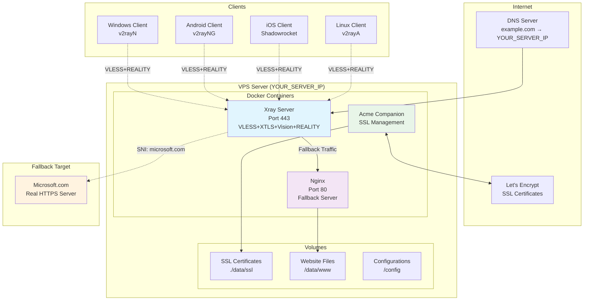
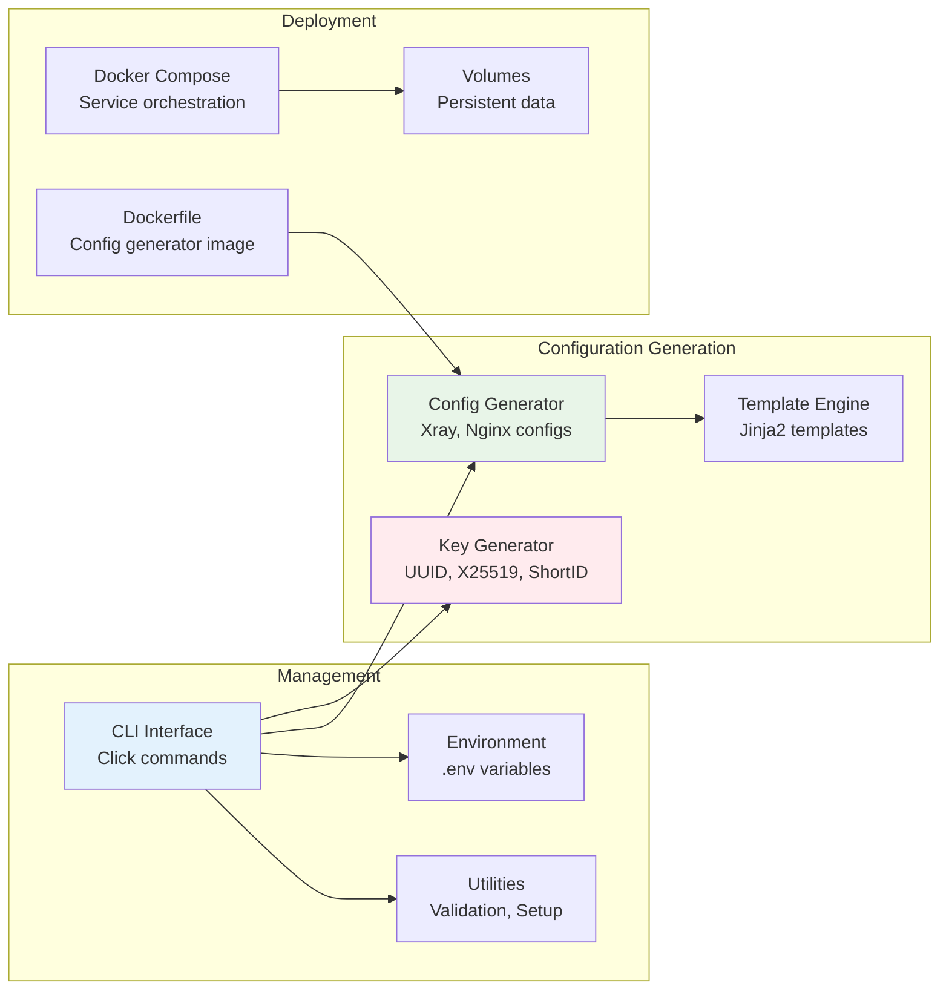
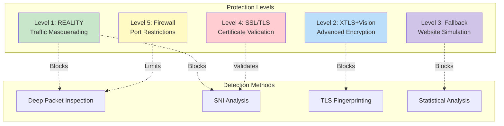
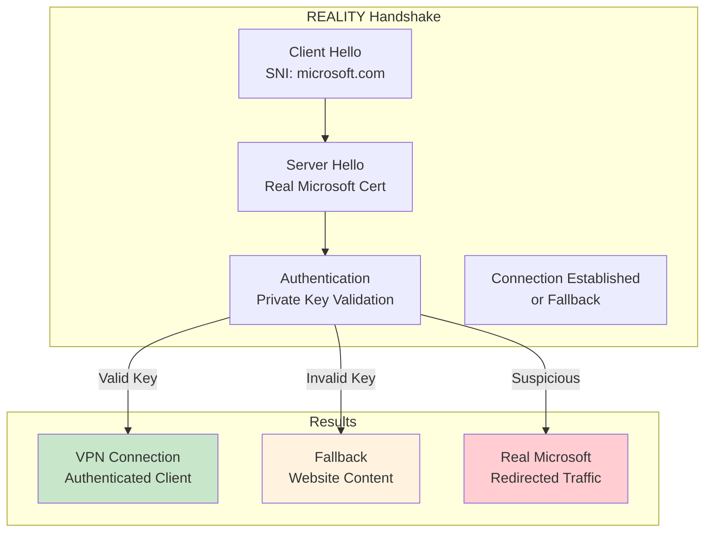
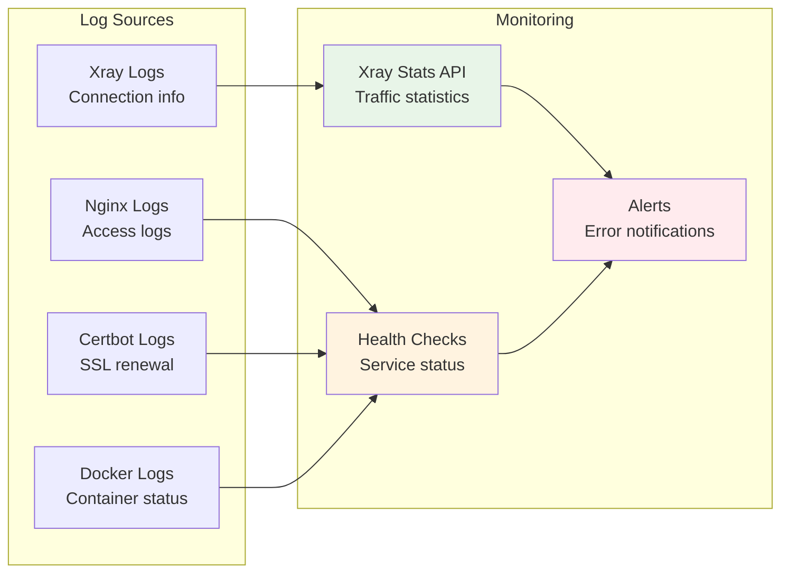

[ru](../../docs/ru/architecture.md)

# Xray VPN Server Architecture

## General System Diagram



## Traffic Flow

```mermaid
sequenceDiagram
    participant Client
    participant Xray
    participant Nginx
    participant Microsoft
    participant Internet
    
    Note over Client,Microsoft: Normal VPN Connection
    Client->>+Xray: VLESS+REALITY (SNI: microsoft.com)
    Xray->>+Internet: Encrypted VPN Traffic
    Internet-->>-Xray: Response
    Xray-->>-Client: Decrypted Response
    
    Note over Client,Microsoft: Fallback upon detection
    Client->>+Xray: Invalid/Detected Traffic
    Xray->>+Nginx: Fallback to port 8080
    Nginx-->>-Xray: Website Content
    Xray-->>-Client: Looks like normal website
    
    Note over Client,Microsoft: Direct connection to Microsoft
    Client->>+Microsoft: Direct HTTPS (if redirected)
    Microsoft-->>-Client: Real Microsoft Content
```

## System Components



## Security



## REALITY Protocol



## Monitoring and Logging

